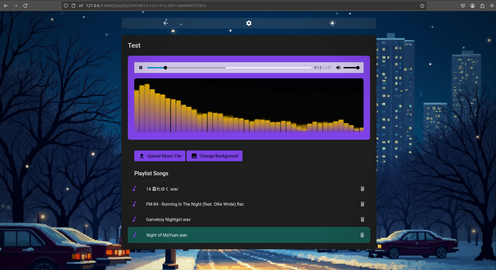

## WebGinPlayer

### What is it?
- This is a web music player implemented with Go/Gin
### Features
- Supports `.wav` and `.flac` files
- Create Playlists with customizable background image
- Google Material Design
- Toggles between dark/light mode (Your choice will be automatically remembered).
- Audio Spectrum Visualization !
### How to use
- `go run main.go`
- Go to `127.0.0.1:8080/playlist` to see the GUI